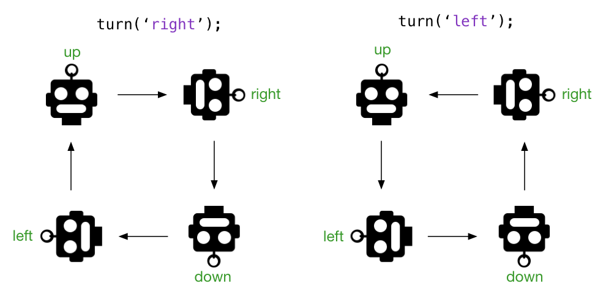

# Robot Programming Details

## Robot state

In the robot code the state of the game is kept in a number of variables at the file level.
The state consist of:

- `board`: a two-dimensional array representing the board,
- `robot`: the `x`, `y` and `dir` (= direction) of the robot,
- `flagReached`: whether the flag has been reached,
- `moves`: the number of moves made so far.

This state is updated as the robot moves and turns.

```js
const board = [
  ['T', 'T', '.', 'F'],
  ['T', '.', '.', '.'],
  ['.', '.', '.', '.'],
  ['R', '.', '.', 'W']
];

const robot = {
  x: 0,
  y: 0,
  dir: 'up',
};

let flagReached = false;
let moves = 0;
```

## Turning the robot

The robot can turn `left` and `right`. The new direction of the robot (indicated by the 'antenna' on its head) depends on its current direction (`up`, `down`, `left`, `right`) and the turn direction. This is illustrated in the picture below.



The following code snippet uses a `switch` statement and [conditional (ternary) operators](https://developer.mozilla.org/en-US/docs/Web/JavaScript/Reference/Operators/Conditional_Operator) to establish the necessary state change of the robot's direction (or should we say _'heading'_ :grinning:).

```js
function turn(turnDirection) {
  if (turnDirection !== 'left' && turnDirection !== 'right') {
    console.log('ignoring invalid turn', turnDirection);
    return;
  }
  switch (robot.dir) {
    case 'up':
      robot.dir = turnDirection === 'left' ? 'left' : 'right';
      break;
    case 'down':
      robot.dir = turnDirection === 'left' ? 'right' : 'left';
      break;
    case 'left':
      robot.dir = turnDirection === 'left' ? 'down' : 'up';
      break;
    case 'right':
      robot.dir = turnDirection === 'left' ? 'up' : 'down';
      break;
  }
}
```

The conditional operator is a convenient short-hand for the alternative of using `if` statements, as we did in class. Its syntax is:

> _condition_ ? _expr1_ : _expr2_

If the condition is `true` the resulting value is `expr1`, otherwise it's `expr2`.

For more details, please refer to [MDN web docs, Conditional (ternary) Operator](https://developer.mozilla.org/en-US/docs/Web/JavaScript/Reference/Operators/Conditional_Operator).

In the code snippet above we are testing whether `turnDirection === 'left'` in the knowledge that if it isn't `left` it must be `right`. Alternatively we could have tested for `turnDirection === 'right'` and swapped the two expressions in each of the conditional operators.

## Moving the robot

Moving the robot means adding or subtracting `1` from either its `y` (vertical) position or its `x` (horizontal) position, depending on the current direction of the robot. As a complicating factor, we also must ensure that the robot doesn't 'fall off the board'. In the code snippet below we again use conditional operators to ensure the `x` and `y` values stay within the range of the `board` array.

```js
function move() {
  let x = robot.x;
  let y = robot.y;

  switch (robot.dir) {
    case 'up':
      y = y < board.length - 1 ? y + 1 : y;
      break;
    case 'down':
      y = y > 0 ? y - 1 : y;
      break;
    case 'left':
      x = x > 0 ? x - 1 : x;
      break;
    case 'right':
      x = x < board[y].length - 1 ? x + 1 : x;
      break;
  }
  ...
}
```

The newly computed `x` and `y` values represent the desired new position of the robot, but we can only move there if there is no obstacle (tree, water) in that position. If there is an obstacle in the newly computed position the robot must stay where he is. Otherwise we can update the robot state to reflect the new position.

The flag is not considered an obstacle but when it is reached we set the `flagReached` state to `true`. And finally, we re-render the board on the screen. The code snippet below shows the complete implementation of the `move()` function.

```js
function move() {
    let x = robot.x;
    let y = robot.y;
    const dir = robot.dir;

    switch (dir) {
        case 'up':
            y = (y < board.length - 1) ? y + 1 : y;
            break;
        case 'down':
            y = (y > 0) ? y - 1 : 0;
            break;
        case 'left':
            x = (x > 0) ? x - 1 : 0;
            break;
        case 'right':
            x = (x < board[y].length - 1) ? x + 1 : x;
            break;
        default:
            console.log('Huh?', dir);
    }

    const targetContents = board[y][x];
    if (targetContents === '.' || targetContents === 'F') {
        board[robot.y][robot.x] = trailIndicators[robot.dir];
        robot.x = x;
        robot.y = y;
        board[y][x] = 'R';
        if (targetContents === 'F') {
            flagReached = true;
        }
    } else {
        console.log('Bumped into', targetContents);
    }

    moves += 1;

    render();
}
```

## Creating HTML elements through the DOM

To render the board as HTML on a web page it was chosen to create a grid use an HTML `<table>` tag. The HTML snippet below gives an idea of what we should create in our JavaScript code.

```html
<table>
  <tr>
    <td>T</td>
    <td>T</td>
    <td></td>
    <td>F</td>
  </tr>
  <tr>
    <td>T</td>
    <td></td>
    <td></td>
    <td>F</td>
  </tr>
  <tr>
    <td></td>
    <td></td>
    <td></td>
    <td></td>
  </tr>
  <tr>
    <td>R</td>
    <td></td>
    <td></td>
    <td>W</td>
  </tr>
</table>
```

We need four `<tr>` elements, one for each row. These `<tr>` elements are children of the `<table>` element.

For each row we need four `<td>` elements to contain the contents of each cell on the board. These `<td>` elements are children of their respective `<tr>` parents.

To create an element we use:

```js
const elem = document.createElement(tagName);
```

Once created, the element must be added to the DOM by appending it to its parent:

```js
parentElement.appendChild(elem);
```

Sometimes it is more convenient to provide the child or children of an element in the form of a JavaScript string. For that purpose we can use an element's `.innerHTML` property.

The `render()` function below shows both options:

```js
function render() {
  const target = document.getElementById('target');
  target.innerHTML = '';
  const table = document.createElement('table');
  target.appendChild(table);
  for (let row = board.length - 1; row >= 0; row--) {
    const cells = board[row];
    const tr = document.createElement('tr');
    table.appendChild(tr);
    let rowHtml = '';
    for (let col = 0; col < cells.length; col++) {
      const cell = cells[col] === '.' ? '' : cells[col];
      rowHtml += `<td>${cell}</td>`;
    }
    tr.innerHTML = rowHtml;
  }
}
```
