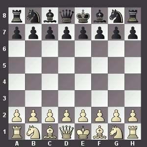

# Week 3 Lecture

## State

### Chess

 
**Initial state** of a chess game1

#### The game of chess:

- There are two players.

- The **state** of the game consist of all the different pieces and their positions on the board.

- The game always starts with a prescribed **initial state**.

- Players take turns and can move one of their pieces to a new position (in compliance with the rules of the game) to cause a **state change**. This brings the game into a **new state**.

- During the game the state continues to change until some **final state** is reached. We can also say that the **state changes over time**.

- The first player that can change the state of the game such that his or her adversary's king is _checkmate_ wins. This is the **final state**.

- Note that if a player moves a piece against the rules of the game, the **state becomes invalid** and needs to be corrected.

1Picture credit: https://www.chess.com/play-chess-online

### JavaScript: state, let and const

In a computer program the **state** of the program consists of all its **variables** and their **values**.

Executing a program cause its **state** to **change over time**. (A program that doesn't change its state over time is useless: it doesn't do anything).

A programming mistake can cause the state to be changed unexpectedly and, most probably, also incorrectly. Such a mistake is called a **bug**.

By minimising the number of variables that allow their values to be changed (and thus change overall state) we can reduce the chance of introducing unintended state changes. That's why in JavaScript we recommend that you use `const` in preference over `let` whenever a variable is not supposed to change after you have set its one and only value.

Note that this gives limited protection only, as you can still modify objects or arrays that a `const` variable refers to. But it is still better than just using `let` (not to mention `var`).
